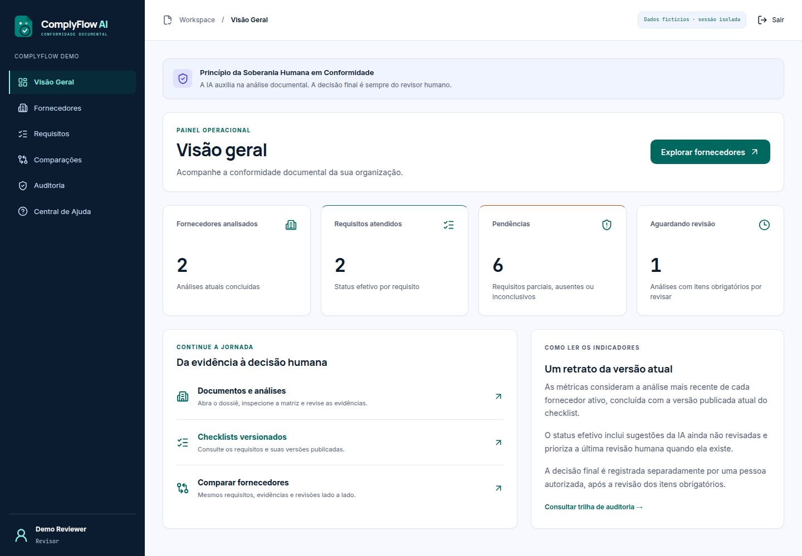
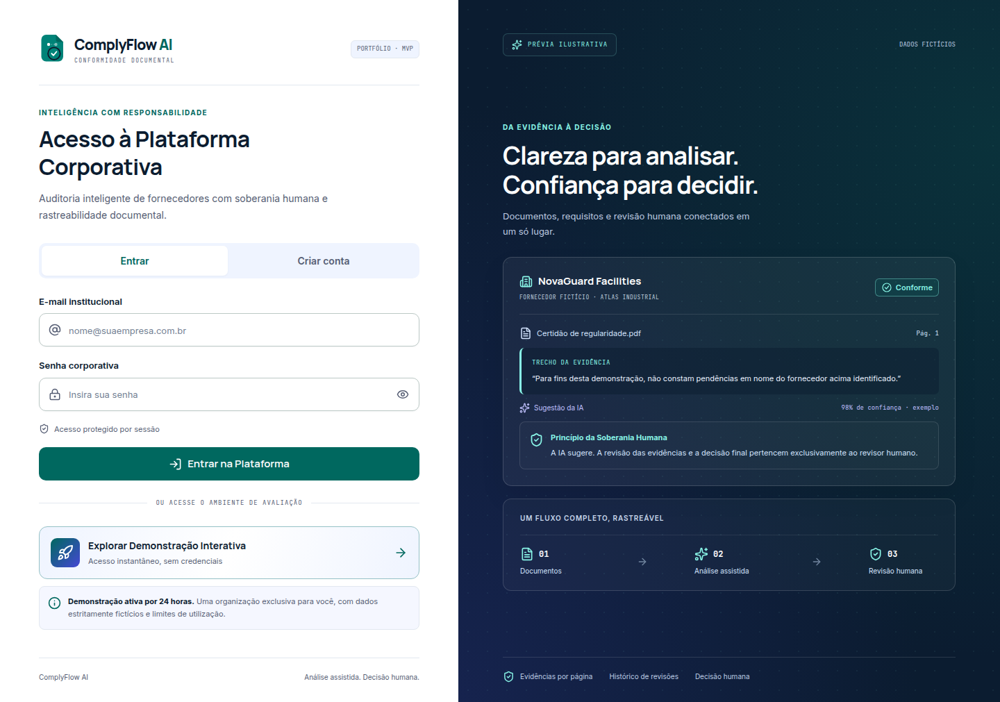
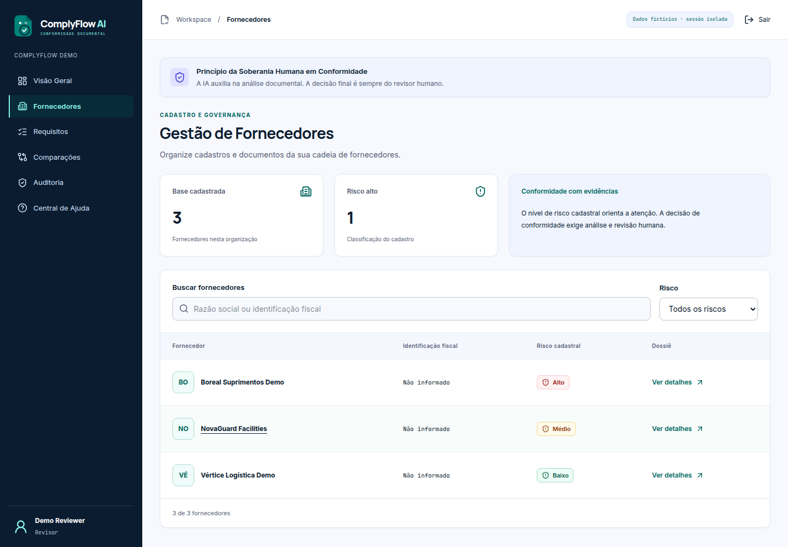
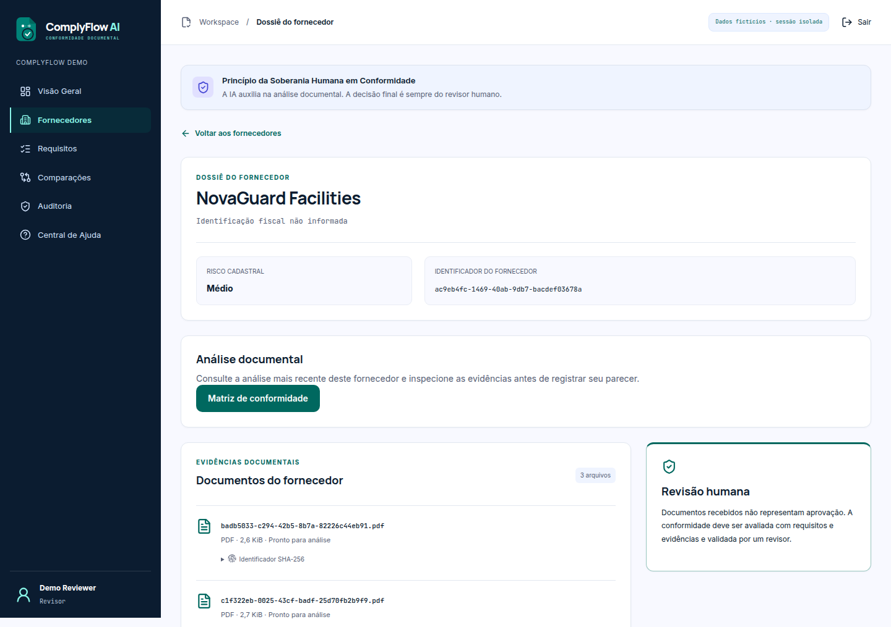
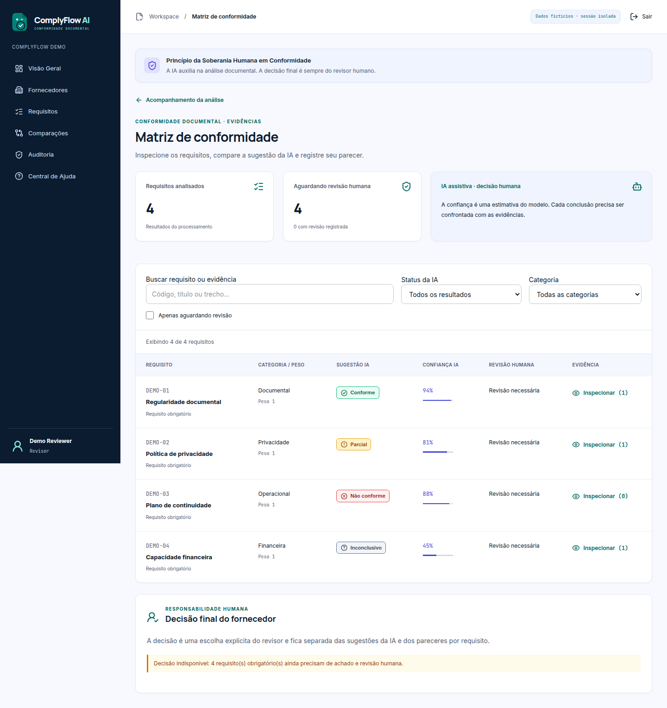
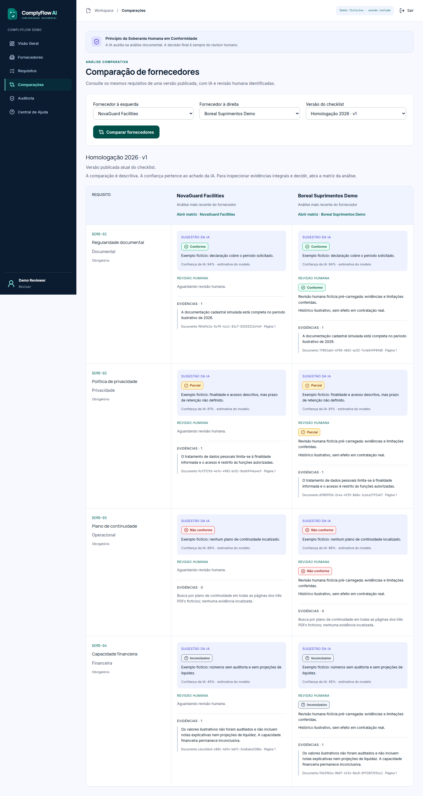
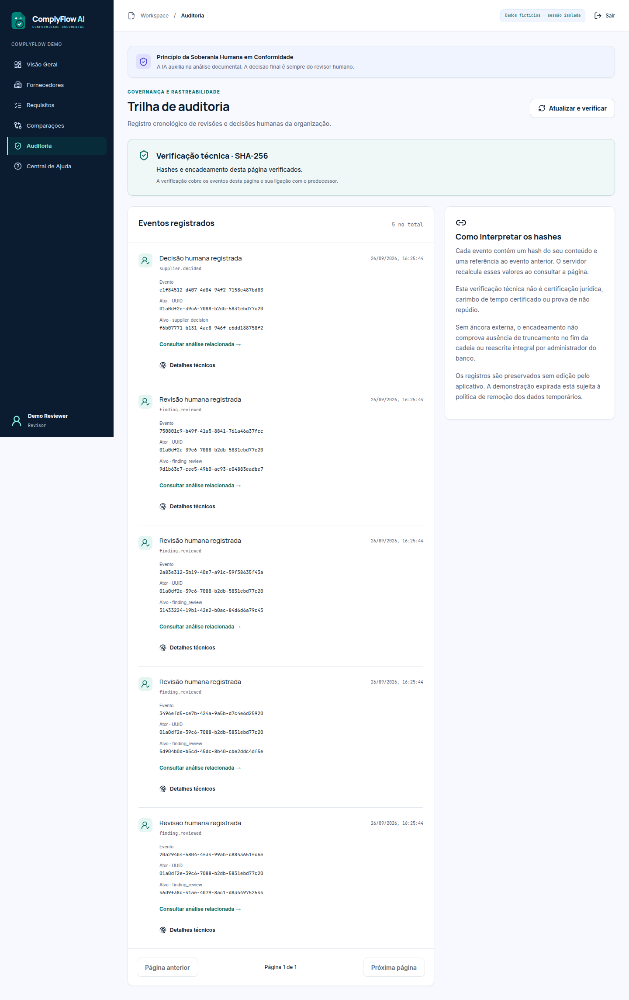
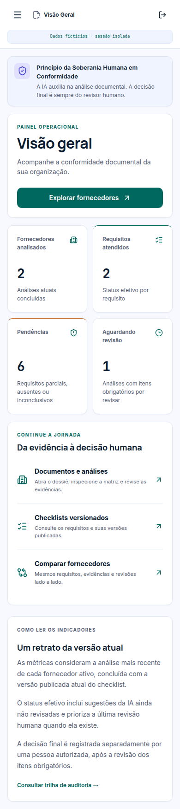
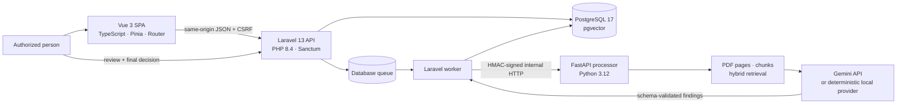
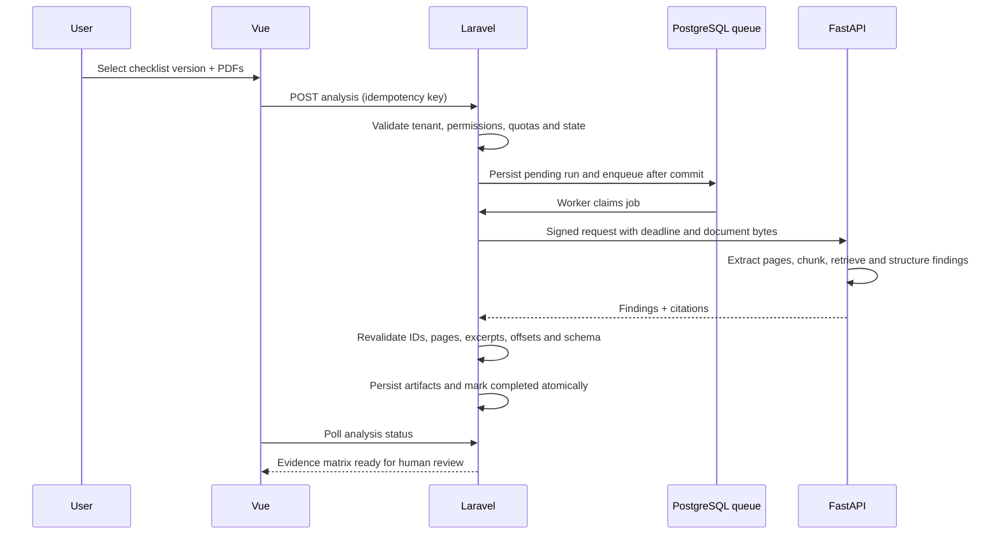

# ComplyFlow AI

<p align="center">
  <strong>From documentary evidence to an accountable human decision.</strong><br>
  A portfolio-grade, multi-tenant compliance workflow built with Laravel, Vue and FastAPI.
</p>

<p align="center">
  <a href="README.md"><strong>English</strong></a> ·
  <a href="README.pt-BR.md">Português (Brasil)</a>
</p>

<p align="center">
  <a href="https://complyflow-ai.onrender.com"><strong>Live application</strong></a> ·
  <a href="https://complyflow-ai.onrender.com/api/health">Health check</a> ·
  <a href="complyflow-ai/docs/architecture.md">Architecture</a> ·
  <a href="complyflow-ai/docs/api.md">API reference</a> ·
  <a href="complyflow-ai/docs/security.md">Security model</a>
</p>

<p align="center">
  <a href="https://github.com/Hugueninfer/complyflow-ai/actions/workflows/ci.yml"></a>
  
  
  
  
  
</p>



> **Portfolio note:** the public environment is an educational demonstration with fictitious suppliers and documents. It is not a certification service, legal opinion or automated approval system. AI output is assistive; an authorized person owns the final decision.

## Why this project exists

Supplier due diligence is often fragmented across e-mail, spreadsheets and PDF folders. Even when an AI model helps locate information, the hard engineering problem remains: keep the evidence, the model suggestion, the human review and the final decision separate, attributable and reproducible.

ComplyFlow AI turns that problem into an end-to-end workflow:

1. an organization registers suppliers;
2. a user creates and publishes a versioned checklist;
3. one or more PDFs are uploaded and validated;
4. Laravel queues a document-analysis job;
5. FastAPI extracts pages, creates bounded chunks and returns structured findings with citations;
6. the UI presents each suggestion beside its page and excerpt;
7. a reviewer explicitly confirms or corrects every required item;
8. an authorized person records a separate, immutable final decision;
9. the audit trail preserves what happened and who was responsible.

The result is not a chatbot wrapped in a dashboard. It is a complete application that demonstrates product design, backend boundaries, asynchronous processing, document handling, multi-tenancy, security controls, automated browser testing and free-tier deployment.

## Try it in five minutes

Open the **[live application](https://complyflow-ai.onrender.com)** and choose **“Explorar Demonstração Interativa”**. No password or paid AI key is required.

Recommended recruiter/technical-reviewer tour:

1. On **Visão Geral**, inspect the operational metrics and the explicit human-sovereignty notice.
2. Open **Fornecedores** and select **NovaGuard Facilities**.
3. Enter its **Matriz de conformidade**.
4. Open each evidence item to see the requirement, AI suggestion, confidence, source document, page and exact excerpt.
5. Compare the four possible outcomes: compliant, partial, non-compliant and inconclusive.
6. Visit **Comparações** and compare NovaGuard with Boreal under the same checklist version.
7. Visit **Auditoria** to inspect the append-only event history and integrity state.
8. For the full authoring flow, sign out, choose **Criar conta**, create a fictitious supplier/checklist, upload one of the sample PDFs in `complyflow-ai/demo-assets/` and start a real queued analysis.

The first request may take around a minute when Render's free web service is sleeping. A demo is isolated per browser visitor, expires after exactly 24 hours and can be resumed while its cookie and database still exist.

## Product gallery

All screenshots below were captured from the deployed application—not from a design mock-up. The data is fictitious and created solely for this portfolio.

### Passwordless, isolated demonstration



The entry page supports a normal account flow and a passwordless portfolio tour. Starting a demo creates a dedicated organization and reviewer session instead of sharing one global public account.

### Supplier workspace





The supplier dossier centralizes identity, risk classification, uploaded documents and analysis history. Mutating controls are permission-aware in the UI and independently enforced by Laravel policies.

### Evidence-first compliance matrix



Every requirement keeps the AI suggestion separate from the latest human review. A finding without a valid page/excerpt cannot silently become evidence, and a `missing` result must describe the search that was performed.

### Descriptive comparison—never an automatic winner



Suppliers are compared against the exact same published checklist version. The screen shows findings, evidence and human corrections side by side, but deliberately does not rank or select a winner.

### Tamper-evident audit trail



Reviews, decisions and audit events are append-only at the application and database layers. Events are hash-chained so local modification can be detected; the documentation is explicit that this is not an external timestamp or independent notarization service.

### Responsive experience

<p align="center">
  
</p>

The core journey is covered at desktop and mobile widths, including an automated horizontal-overflow assertion.

## Feature map

| Area | What is implemented | Engineering signal |
|---|---|---|
| Identity | Registration, login, logout, server-side sessions and CSRF | Laravel Sanctum; no auth token in Web Storage |
| Multi-tenancy | Organization-scoped suppliers, documents, requirements, analyses and decisions | UUID public identifiers, scoped resolution, policies and IDOR tests |
| Demo | One isolated organization per visitor for exactly 24 hours | Transactional clone, quotas, resumable cookie and explicit purge rules |
| Suppliers | Registration, editing, risk metadata and dossier | Permission-aware Vue UX plus server-side RBAC |
| Checklists | Draft authoring, immutable publication and version selection | Analyses retain the exact requirement-set version |
| Documents | PDF upload, signature/MIME validation, hashing and deduplication | 5 MiB per file; bounded total; content treated as hostile input |
| Pipeline | Queue-backed analysis with retries, time budgets and idempotency | PostgreSQL queue; Laravel–FastAPI signed contract |
| Findings | Structured status, rationale, confidence and citations | Page/offset/excerpt consistency is revalidated before persistence |
| Human review | Explicit inspection, correction and justification | AI suggestion is preserved; review is a separate append-only record |
| Final decision | Approved, conditional or rejected by an authorized person | Separate permission, acknowledgement and immutable record |
| Comparison | Two suppliers under one checklist version | Descriptive display with no automatic recommendation |
| Audit | Actor, action, subject, timestamp and hash-chain integrity | Append-only database triggers and integrity verification |
| Quality | Domain, contract, component, browser and production-image checks | CI exercises real services rather than mocked HTTP journeys |

## Architecture



### Responsibility boundaries

- **Vue** owns presentation, navigation and interaction state. It never decides authorization and never talks directly to the Python service.
- **Laravel** is the source of truth. It owns identity, tenant boundaries, RBAC, validation, idempotency, job state, persistence, human review, decisions and auditing.
- **FastAPI** is a stateless internal processor. It extracts and evaluates documents under explicit resource limits and returns a closed response schema.
- **PostgreSQL** stores business data, sessions, cache/rate-limit state, jobs, PDF bytes, extracted pages/chunks and 384-dimensional vectors.
- **Nginx + Supervisor** compose the free Render runtime: the public port serves the SPA/API while PHP-FPM, the queue worker and FastAPI remain internal processes.

Read the full rationale in **[Architecture and trade-offs](complyflow-ai/docs/architecture.md)**.

## Document-analysis pipeline



New analyses in the deployed owner workflow use Google's native Gemini `generateContent` API. FastAPI sends only the five highest-ranked excerpts for each requirement, requests a closed JSON schema with minimal reasoning, and revalidates the returned document, page, exact quote and offsets before Laravel persists anything. `gemini-3.1-flash-lite` is selected by environment because Google explicitly lists it for structured output and currently provides a Gemini free tier; quotas and model availability remain controlled by Google. A global database-serialized budget admits at most 20 requirement evaluations per UTC day across all accounts. The passwordless showcase itself remains pre-seeded with fictitious results so a recruiter can tour it without consuming API quota.

Local development and CI keep the deterministic `fake` provider as their default and make no external AI call. Retrieval still combines deterministic 384-dimensional hashing vectors with textual matching; these local vectors do **not** claim the semantic quality of trained embeddings. Under the unpaid Gemini service, Google states that submitted content and generated responses are used to improve its products. The public portfolio instance is intended only for fictitious documents and shows this warning before analysis; it cannot technically prove that an uploaded PDF is fictitious. See the [Gemini API terms](https://ai.google.dev/gemini-api/terms).

## Human sovereignty by design

The product model intentionally separates three concepts:

| Layer | Meaning | Can it make the final decision? |
|---|---|---|
| AI suggestion | Machine-produced status, rationale, confidence and citations | No |
| Human review | A reviewer confirms or corrects one requirement with justification | No |
| Final decision | An authorized person records the organizational outcome | Yes |

The application never auto-approves a supplier. Required findings must be reviewed before a final decision is enabled. The original machine suggestion remains visible after correction, preserving the distinction between automation and accountability.

See **[Human review and audit](complyflow-ai/docs/human-review-audit.md)** for concurrency, immutability and integrity rules.

## Security model

Security-relevant behaviors are part of the domain and test suite rather than presentation-only controls:

- organization scope is resolved on every protected resource;
- public IDs are UUIDs, but secrecy of IDs is never treated as authorization;
- Laravel policies enforce RBAC independently of hidden/disabled Vue controls;
- same-origin cookies, CSRF protection, Secure/HttpOnly production cookies, CSP and defensive headers are configured;
- PDF MIME, `%PDF-` signature, size, hash, quota and deduplication are validated;
- extraction and analysis have time, memory and concurrency budgets;
- the Laravel–FastAPI request is HMAC-authenticated with timestamp and replay protection;
- returned document IDs, page numbers, excerpts and offsets are checked again by Laravel;
- error responses and logs avoid reflecting document contents or secrets;
- final decisions, reviews and audit rows are protected against update/delete by database triggers.

Residual risks and operational limits are documented instead of hidden: **[security model](complyflow-ai/docs/security.md)** and **[processor orchestration](complyflow-ai/docs/processor-orchestration.md)**.

## Technology stack

| Layer | Technology |
|---|---|
| Web | Vue 3, TypeScript, Composition API, Pinia, Vue Router, Vite 8, Tailwind CSS 4 |
| API/domain | PHP 8.4, Laravel 13, Sanctum, queues, policies, service layer |
| Document processor | Python 3.12, FastAPI, Pydantic, pypdf, Uvicorn |
| Data | PostgreSQL 17, pgvector, `bytea` document storage |
| Runtime | Nginx, PHP-FPM, Supervisor, Docker multi-stage build |
| Verification | PHPUnit, pytest, Vitest, Vue Testing Library, Playwright, contract tests |
| Delivery | GitHub Actions, Render Blueprint (`render.yaml`) |

The visual language follows the supplied Stitch reference, **Sovereign Compliance Interface**: structural navy, teal actions, indigo reserved for assisted intelligence, evidence cards and locally served fonts/icons.

## Repository structure

```text
.
├── .github/workflows/ci.yml          # Full verification pipeline
├── README.md                         # English portfolio presentation
├── README.pt-BR.md                   # Brazilian Portuguese version
└── complyflow-ai/
    ├── apps/
    │   ├── api/                      # Laravel API and domain
    │   └── web/                      # Vue SPA
    ├── services/processor/           # FastAPI document processor
    ├── e2e/                          # Playwright journeys and screenshot capture
    ├── demo-assets/                  # Reproducible, strictly fictitious PDFs
    ├── docs/                         # Architecture, API, security and operations
    ├── infra/docker/                 # Development and production images
    ├── scripts/                      # Verification and production smoke tests
    ├── compose.yaml                  # Local multi-service environment
    └── render.yaml                   # Free-tier infrastructure as code
```

## Run locally

Requirements: Git, Docker Engine/Desktop with Compose v2, OpenSSL and free ports `5173`, `8000` and `8001`. PHP, Composer, Node and Python run inside containers.

```bash
git clone https://github.com/Hugueninfer/complyflow-ai.git
cd complyflow-ai/complyflow-ai
cp .env.example .env
export PROCESSOR_HMAC_SECRET="$(openssl rand -hex 32)"
docker compose up --build
```

Wait for the health checks, then open **[http://localhost:5173](http://localhost:5173)**. The queue service applies migrations and the idempotent seed. The local PostgreSQL password in Compose is development-only and its port is not published to the host.

Useful endpoints:

| Endpoint | Purpose |
|---|---|
| `http://localhost:5173` | Vue development application |
| `http://localhost:8000/api/health` | Laravel/database/processor aggregate health |
| `http://localhost:8001/health` | Internal processor health in local development |

Stop services with `docker compose down`. `docker compose down -v` also permanently deletes the disposable local database volume—do not use it on data you intend to keep.

## Test and quality strategy

Use a disposable local database: the Laravel suite and the verification script rebuild test tables.

```bash
docker compose stop queue
docker compose --profile e2e build
bash scripts/verify.sh
bash scripts/production-smoke.sh
```

The verification layers cover:

- Laravel domain/API behavior, tenant boundaries, RBAC, concurrency and IDOR cases;
- FastAPI schemas, PDF handling, resource limits and sanitized failures;
- Vue components, stores, routes, accessibility-facing names and error states;
- cross-language HMAC canonicalization and contract compatibility;
- real Playwright journeys for both the isolated demo and a new owner organization;
- registration, checklist publication, PDF upload, real queue processing, evidence review, final decision, logout/login and deep-link restoration;
- the production Docker image under the free plan's `512 MiB / 0.1 CPU` constraints;
- health, SPA routes, CSRF, restarts, migrations, seed idempotency and dependency audits.

Browser tests do not replace API responses with mocks. GitHub Actions runs the same verification in **[CI](https://github.com/Hugueninfer/complyflow-ai/actions)**.

### Refresh the portfolio screenshots

The committed gallery is reproducible against any deployed environment:

```bash
cd complyflow-ai/e2e
npm ci
README_BASE_URL=https://complyflow-ai.onrender.com npm run capture:readme
```

The script creates isolated demo sessions, navigates only through fictitious data and writes to `complyflow-ai/docs/screenshots/live/`.

## Free deployment on Render

The live portfolio uses one free Docker web service and one free PostgreSQL database declared in **[`render.yaml`](complyflow-ai/render.yaml)**.

The production image compiles Vue, installs production PHP/Python dependencies and runs Nginx, PHP-FPM, the Laravel queue worker and FastAPI in one container. This packaging is a deliberate free-tier trade-off; the internal application contracts remain separate.

Deployment characteristics:

- secrets are generated or injected by Render and are never committed;
- the database is private and `DB_URL` is provided through the Blueprint;
- migrations, vector extension, idempotent seed, demo cleanup and caches run under a startup advisory lock;
- the public health check reports Laravel, database and processor readiness;
- the free web service can sleep after inactivity, producing a cold start;
- free PostgreSQL storage/lifetime/backups are not production-grade and can require recreation;
- PDF blobs live in PostgreSQL because the container filesystem is ephemeral;
- OCR is disabled in the constrained public environment.

For reproducible setup and recovery instructions, see **[Deploying on Render Free](complyflow-ai/docs/render-free-deploy.md)**.

## API and technical documentation

| Document | Subject |
|---|---|
| [API](complyflow-ai/docs/api.md) | Public JSON endpoints, resources and error behavior |
| [Architecture](complyflow-ai/docs/architecture.md) | Boundaries, persistence and production runtime |
| [Demo](complyflow-ai/docs/demo.md) | Isolation, expiration, quotas, seed and fictitious assets |
| [Dashboard and comparison](complyflow-ai/docs/dashboard-comparison.md) | Aggregations, effective status and comparison semantics |
| [Human review and audit](complyflow-ai/docs/human-review-audit.md) | Review lifecycle, decisions, append-only rules and integrity |
| [Processor orchestration](complyflow-ai/docs/processor-orchestration.md) | Queue, signatures, retries, deadlines and validation |
| [Security](complyflow-ai/docs/security.md) | Threat model, controls and residual risks |
| [Dependency review](complyflow-ai/docs/dependency-review.md) | Audits, licenses and pinned runtimes |
| [Render deployment](complyflow-ai/docs/render-free-deploy.md) | Blueprint, secrets, verification and recovery |

## Deliberate limitations

This demonstration does not include password recovery, e-mail verification, SSO, real government-registry integrations, digital signatures, external audit anchoring or automatic supplier certification. Gemini suggestions are not legal or compliance conclusions and may be wrong. OCR is not connected to the public pipeline, so image-only PDFs may produce no evidence. The free deployment has no SLA and has not been certified for production load.

These constraints are visible because a trustworthy compliance product should be precise about what it cannot guarantee.

## Roadmap

- move document blobs to encrypted object storage with retention policies;
- split web, queue and processor into independently scaled services;
- add a durable outbox and interrupted-job reconciliation;
- use a shared replay cache before horizontal processor scaling;
- add OCR with sandboxing and the same citation guarantees;
- paginate very large matrices and audit streams;
- add scheduled demo cleanup, backups and privacy-safe observability;
- add formal Gemini evaluation datasets, quota telemetry and stronger redaction controls;
- add e-mail verification, password recovery and enterprise identity providers;
- externally anchor audit-chain checkpoints where regulatory context requires it.

## Author and license

Created by **[Hugueninfer](https://github.com/Hugueninfer)** as a full-stack portfolio case focused on responsible AI, traceability and production-minded engineering.

Original project code is available under the **[MIT License](complyflow-ai/LICENSE)**. Third-party packages, fonts and base images retain their own licenses. Contribution guidance is in **[CONTRIBUTING.md](complyflow-ai/CONTRIBUTING.md)**.
