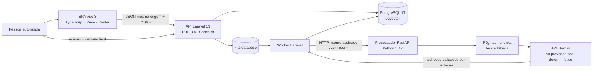
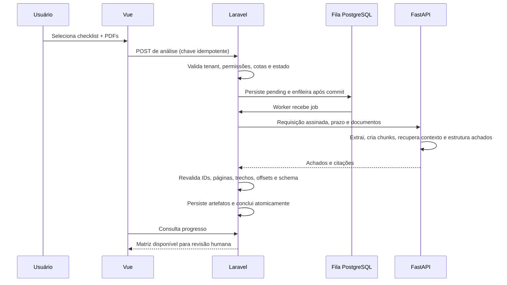

# ComplyFlow AI

<p align="center">
  <strong>Da evidência documental à decisão humana responsável.</strong><br>
  Uma plataforma de compliance multi-tenant, pronta para portfólio, construída com Laravel, Vue e FastAPI.
</p>

<p align="center">
  <a href="README.md">English</a> ·
  <a href="README.pt-BR.md"><strong>Português (Brasil)</strong></a>
</p>

<p align="center">
  <a href="https://complyflow-ai.onrender.com"><strong>Aplicação ao vivo</strong></a> ·
  <a href="https://complyflow-ai.onrender.com/api/health">Health check</a> ·
  <a href="complyflow-ai/docs/architecture.md">Arquitetura</a> ·
  <a href="complyflow-ai/docs/api.md">Referência da API</a> ·
  <a href="complyflow-ai/docs/security.md">Modelo de segurança</a>
</p>

<p align="center">
  <a href="https://github.com/Hugueninfer/complyflow-ai/actions/workflows/ci.yml"></a>
  
  
  
  
  
</p>


> **Nota de portfólio:** o ambiente público é uma demonstração educacional com fornecedores e documentos fictícios. Não é um serviço de certificação, parecer jurídico nem sistema de aprovação automática. A IA é assistiva; a decisão final pertence a uma pessoa autorizada.

## Por que este projeto existe

A diligência de fornecedores costuma ficar fragmentada entre e-mails, planilhas e pastas de PDFs. Mesmo quando a IA ajuda a localizar informações, o principal problema de engenharia continua existindo: preservar separadamente a evidência, a sugestão do modelo, a revisão humana e a decisão final, com autoria e rastreabilidade.

O ComplyFlow AI transforma esse problema em um fluxo completo:

1. uma organização cadastra fornecedores;
2. uma pessoa cria e publica um checklist versionado;
3. um ou mais PDFs são enviados e validados;
4. o Laravel enfileira uma análise documental;
5. o FastAPI extrai páginas, cria chunks limitados e devolve achados estruturados com citações;
6. a interface apresenta cada sugestão junto da página e do trecho exato;
7. um revisor confirma ou corrige explicitamente cada item obrigatório;
8. uma pessoa autorizada registra uma decisão final separada e imutável;
9. a trilha de auditoria preserva o que aconteceu e quem foi responsável.

O resultado não é apenas um chatbot dentro de um dashboard. É uma aplicação completa que demonstra design de produto, fronteiras de backend, processamento assíncrono, documentos, multi-tenancy, controles de segurança, testes reais de navegador e deploy gratuito.

## Experimente em cinco minutos

Abra a **[aplicação ao vivo](https://complyflow-ai.onrender.com)** e escolha **“Explorar Demonstração Interativa”**. Não é necessária senha nem chave de IA paga.

Roteiro recomendado para recrutadores e avaliadores técnicos:

1. Em **Visão Geral**, observe os indicadores e o aviso explícito de soberania humana.
2. Abra **Fornecedores** e selecione **NovaGuard Facilities**.
3. Entre na **Matriz de conformidade**.
4. Inspecione cada evidência para ver requisito, sugestão da IA, confiança, documento, página e trecho exato.
5. Compare os quatro resultados: conforme, parcial, não conforme e inconclusivo.
6. Em **Comparações**, coloque NovaGuard e Boreal lado a lado sob a mesma versão do checklist.
7. Em **Auditoria**, confira os eventos append-only e o estado de integridade.
8. Para percorrer a autoria completa, saia, escolha **Criar conta**, cadastre fornecedor/checklist fictícios, envie um PDF de `complyflow-ai/demo-assets/` e inicie uma análise real pela fila.

A primeira requisição pode levar aproximadamente um minuto quando o serviço gratuito do Render está hibernando. Cada demo é isolada por visitante, expira exatamente após 24 horas e pode ser retomada enquanto seu cookie e o banco existirem.

## Galeria do produto

Todos os prints foram capturados na aplicação publicada, não em um mockup. Os dados são fictícios e existem apenas para este portfólio.

### Demonstração isolada e sem senha


A tela inicial oferece uma conta normal e um tour de portfólio sem senha. Ao iniciar a demo, a aplicação cria uma organização e uma sessão de revisor exclusivas, em vez de compartilhar uma conta pública global.

### Workspace de fornecedores


O dossiê centraliza identidade, risco, documentos e histórico de análises. Os controles de mutação respeitam permissões na interface e são novamente impostos por policies do Laravel.

### Matriz de conformidade orientada a evidências


Cada requisito mantém a sugestão da IA separada da revisão humana mais recente. Um achado sem página/trecho válido não se transforma silenciosamente em evidência, e um resultado ausente precisa descrever a busca executada.

### Comparação descritiva, sem vencedor automático


Os fornecedores são comparados sob a mesma versão publicada do checklist. A tela mostra achados, evidências e correções humanas lado a lado, mas deliberadamente não ranqueia nem escolhe um vencedor.

### Trilha de auditoria com detecção de alterações


Revisões, decisões e eventos são append-only na aplicação e no banco. Os eventos formam uma cadeia de hashes capaz de detectar alteração local; a documentação deixa claro que isso não equivale a carimbo de tempo externo ou cartório independente.

### Experiência responsiva

<p align="center">
  
</p>

A jornada principal é coberta em desktop e mobile, incluindo uma asserção automatizada contra overflow horizontal.

## Mapa de funcionalidades

| Área | O que foi implementado | Sinal de engenharia |
|---|---|---|
| Identidade | Cadastro, login, logout, sessão no servidor e CSRF | Laravel Sanctum; nenhum token em Web Storage |
| Multi-tenancy | Fornecedores, documentos, requisitos, análises e decisões por organização | UUID público, resolução com escopo, policies e testes de IDOR |
| Demo | Uma organização isolada por visitante durante 24 horas exatas | Clone transacional, cotas, cookie retomável e regras explícitas de purga |
| Fornecedores | Cadastro, edição, risco e dossiê | UX sensível a permissão e RBAC no servidor |
| Checklists | Rascunho, publicação imutável e seleção de versão | A análise preserva a versão exata usada |
| Documentos | PDF, assinatura/MIME, hash e deduplicação | 5 MiB por arquivo, cota total e conteúdo tratado como hostil |
| Pipeline | Análise por fila, retries, orçamento de tempo e idempotência | Fila PostgreSQL e contrato Laravel–FastAPI assinado |
| Achados | Status, justificativa, confiança e citações estruturadas | Página, offsets e trecho são revalidados antes de persistir |
| Revisão humana | Inspeção, correção e justificativa explícitas | Sugestão original preservada; revisão em registro append-only |
| Decisão final | Aprovar, condicionar ou rejeitar por pessoa autorizada | Permissão separada, confirmação e imutabilidade |
| Comparação | Dois fornecedores na mesma versão | Exibição descritiva sem recomendação automática |
| Auditoria | Ator, ação, objeto, horário e cadeia de hashes | Triggers append-only e verificação de integridade |
| Qualidade | Testes de domínio, contrato, componente, navegador e imagem final | CI usa serviços reais em vez de simular a jornada HTTP |

## Arquitetura



### Fronteiras de responsabilidade

- **Vue** cuida de apresentação, navegação e estado de interação. Nunca decide autorização e nunca acessa o Python diretamente.
- **Laravel** é a fonte de verdade: identidade, tenant, RBAC, validação, idempotência, jobs, persistência, revisões, decisões e auditoria.
- **FastAPI** é um processador interno stateless: extrai e avalia documentos sob limites explícitos e devolve um schema fechado.
- **PostgreSQL** mantém domínio, sessões, cache/limites, jobs, bytes dos PDFs, páginas/chunks e vetores de 384 dimensões.
- **Nginx + Supervisor** compõem o runtime gratuito: a porta pública serve SPA/API; PHP-FPM, worker e FastAPI permanecem internos.

Leia **[Arquitetura e escolhas](complyflow-ai/docs/architecture.md)**.

## Pipeline documental



Novas análises no fluxo autenticado publicado usam a API Gemini do Google pelo endpoint oficial compatível com OpenAI. O FastAPI envia somente os cinco trechos mais relevantes de cada requisito, exige um schema JSON fechado e revalida documento, página, citação literal e offsets antes de o Laravel persistir qualquer resultado. O modelo `gemini-3.8-flash` é escolhido por ambiente e possui nível gratuito atualmente; cotas e disponibilidade continuam sob controle do Google. O tour sem senha permanece pré-carregado com resultados fictícios para não consumir a cota da API durante uma avaliação do portfólio.

Desenvolvimento local e CI continuam usando o provedor determinístico `fake` por padrão, sem chamada externa. A recuperação combina vetores de hashing determinístico de 384 dimensões com texto; esses vetores locais não prometem a qualidade semântica de embeddings treinados. Prompts do nível gratuito do Gemini podem ser usados pelo Google para melhorar seus produtos; por isso, a instância pública aceita somente documentos fictícios.

## Soberania humana por design

| Camada | Significado | Decide sozinha? |
|---|---|---|
| Sugestão da IA | Status, justificativa, confiança e citações produzidos pela máquina | Não |
| Revisão humana | Um revisor confirma/corrige o requisito com justificativa | Não |
| Decisão final | Uma pessoa autorizada registra o resultado da organização | Sim |

O sistema nunca aprova fornecedor automaticamente. Achados obrigatórios precisam de revisão antes da decisão final. A sugestão original permanece visível após correção, preservando a diferença entre automação e responsabilidade.

Veja **[Revisão humana e auditoria](complyflow-ai/docs/human-review-audit.md)**.

## Modelo de segurança

- escopo da organização em todo recurso protegido;
- UUIDs públicos sem tratar obscuridade como autorização;
- RBAC por policies do Laravel, independente da interface;
- cookies same-origin, CSRF, Secure/HttpOnly em produção, CSP e headers defensivos;
- validação de MIME, assinatura `%PDF-`, tamanho, hash, cota e duplicidade;
- orçamentos de tempo, memória e concorrência na extração/análise;
- HMAC, timestamp e proteção contra replay entre Laravel e FastAPI;
- revalidação de documento, página, trecho e offset ao receber resultados;
- erros e logs sem refletir conteúdo documental ou segredos;
- triggers contra update/delete de revisões, decisões e auditoria.

Riscos residuais e limites operacionais: **[Segurança](complyflow-ai/docs/security.md)** e **[Orquestração](complyflow-ai/docs/processor-orchestration.md)**.

## Stack tecnológica

| Camada | Tecnologia |
|---|---|
| Web | Vue 3, TypeScript, Composition API, Pinia, Vue Router, Vite 8, Tailwind CSS 4 |
| API/domínio | PHP 8.4, Laravel 13, Sanctum, filas, policies e serviços |
| Processador | Python 3.12, FastAPI, Pydantic, pypdf e Uvicorn |
| Dados | PostgreSQL 17, pgvector e PDFs em `bytea` |
| Runtime | Nginx, PHP-FPM, Supervisor e build Docker multi-stage |
| Verificação | PHPUnit, pytest, Vitest, Vue Testing Library, Playwright e contratos |
| Entrega | GitHub Actions e Render Blueprint (`render.yaml`) |

O visual segue a referência Stitch fornecida, **Sovereign Compliance Interface**: navy estrutural, teal para ações, índigo reservado à inteligência assistiva, cartões de evidência e fontes/ícones locais.

## Estrutura do repositório

```text
.
├── .github/workflows/ci.yml          # Verificação completa
├── README.md                         # Apresentação principal em inglês
├── README.pt-BR.md                   # Esta versão em português
└── complyflow-ai/
    ├── apps/api/                     # Laravel
    ├── apps/web/                     # Vue
    ├── services/processor/           # FastAPI
    ├── e2e/                          # Playwright e captura dos prints
    ├── demo-assets/                  # PDFs reproduzíveis e fictícios
    ├── docs/                         # Arquitetura, API, segurança e operação
    ├── infra/docker/                 # Imagens de desenvolvimento/produção
    ├── scripts/                      # Verificação e smoke de produção
    ├── compose.yaml                  # Ambiente local
    └── render.yaml                   # Infraestrutura gratuita como código
```

## Executar localmente

Pré-requisitos: Git, Docker Engine/Desktop com Compose v2, OpenSSL e portas `5173`, `8000` e `8001` livres. PHP, Composer, Node e Python rodam nos containers.

```bash
git clone https://github.com/Hugueninfer/complyflow-ai.git
cd complyflow-ai/complyflow-ai
cp .env.example .env
export PROCESSOR_HMAC_SECRET="$(openssl rand -hex 32)"
docker compose up --build
```

Aguarde os health checks e abra **[http://localhost:5173](http://localhost:5173)**. O serviço da fila aplica migrations e seed idempotente. A senha PostgreSQL do Compose é exclusiva de desenvolvimento e a porta do banco não é publicada no host.

| Endpoint | Uso |
|---|---|
| `http://localhost:5173` | Aplicação Vue local |
| `http://localhost:8000/api/health` | Saúde agregada de Laravel, banco e processador |
| `http://localhost:8001/health` | Saúde interna do FastAPI no desenvolvimento |

Pare com `docker compose down`. `docker compose down -v` também apaga permanentemente o volume local descartável; não use sobre dados que deseja preservar.

## Estratégia de testes

Use um banco local descartável, pois a suíte Laravel e o script de verificação recriam tabelas.

```bash
docker compose stop queue
docker compose --profile e2e build
bash scripts/verify.sh
bash scripts/production-smoke.sh
```

A verificação cobre:

- domínio/API Laravel, tenants, RBAC, concorrência e tentativas de IDOR;
- schemas FastAPI, PDFs, limites de recursos e falhas sanitizadas;
- componentes, stores, rotas e estados de erro do Vue;
- canonicalização HMAC e contrato entre linguagens;
- jornadas Playwright reais da demo e de uma organização owner nova;
- cadastro, publicação, upload, fila real, evidência, revisão, decisão e restauração de sessão/deep link;
- imagem de produção sob `512 MiB / 0,1 CPU`, equivalentes ao plano gratuito;
- health, SPA, CSRF, reinício, migrations, seed idempotente e auditorias de dependências.

Os testes de navegador não simulam respostas HTTP. O GitHub Actions executa a mesma verificação na **[CI](https://github.com/Hugueninfer/complyflow-ai/actions)**.

### Atualizar os prints do portfólio

```bash
cd complyflow-ai/e2e
npm ci
README_BASE_URL=https://complyflow-ai.onrender.com npm run capture:readme
```

O script cria demos isoladas, navega somente por dados fictícios e grava em `complyflow-ai/docs/screenshots/live/`.

## Deploy gratuito no Render

A demo usa um Web Service Docker gratuito e um PostgreSQL gratuito declarados em **[`render.yaml`](complyflow-ai/render.yaml)**.

A imagem compila Vue, instala dependências PHP/Python e executa Nginx, PHP-FPM, worker e FastAPI no mesmo container. Esse empacotamento é uma escolha do free tier; os contratos internos permanecem separados.

- segredos são gerados/injetados pelo Render e nunca versionados;
- o banco é privado e o `DB_URL` vem do Blueprint;
- migrations, extensão vector, seed, limpeza de demos e caches usam advisory lock no startup;
- o health público confirma Laravel, banco e processador;
- o web gratuito pode hibernar e apresentar cold start;
- duração, armazenamento e backups do banco gratuito não são adequados à produção;
- PDFs ficam no PostgreSQL porque o filesystem do container é efêmero;
- OCR permanece desativado no ambiente público restrito.

Veja **[Publicação no Render Free](complyflow-ai/docs/render-free-deploy.md)**.

## Documentação técnica

| Documento | Tema |
|---|---|
| [API](complyflow-ai/docs/api.md) | Endpoints, recursos e erros |
| [Arquitetura](complyflow-ai/docs/architecture.md) | Fronteiras, persistência e runtime |
| [Demonstração](complyflow-ai/docs/demo.md) | Isolamento, expiração, cotas e dados fictícios |
| [Dashboard e comparação](complyflow-ai/docs/dashboard-comparison.md) | Agregações, status efetivo e semântica |
| [Revisão e auditoria](complyflow-ai/docs/human-review-audit.md) | Ciclo, decisões, append-only e integridade |
| [Orquestração](complyflow-ai/docs/processor-orchestration.md) | Fila, assinaturas, retries, prazos e validação |
| [Segurança](complyflow-ai/docs/security.md) | Ameaças, controles e riscos residuais |
| [Dependências](complyflow-ai/docs/dependency-review.md) | Auditorias, licenças e runtimes fixados |
| [Render](complyflow-ai/docs/render-free-deploy.md) | Blueprint, segredos, verificação e recuperação |

## Limitações deliberadas

A demo não inclui recuperação de senha, verificação de e-mail, SSO, consultas reais a órgãos, assinatura digital, âncora externa de auditoria nem certificação automática. Sugestões do Gemini não são conclusões jurídicas ou de compliance e podem estar erradas. OCR não está ligado ao pipeline público; PDFs apenas com imagem podem ficar sem evidência. O deploy gratuito não possui SLA nem foi certificado para carga de produção.

Esses limites são visíveis porque um produto responsável de compliance precisa ser preciso sobre o que não garante.

## Roadmap

- mover PDFs para object storage criptografado com retenção;
- separar web, fila e processador para escala independente;
- adicionar outbox durável e reconciliação de jobs interrompidos;
- usar cache compartilhado de replay antes de escalar horizontalmente;
- adicionar OCR com sandbox e as mesmas garantias de citação;
- paginar matrizes e auditorias grandes;
- automatizar limpeza, backups e observabilidade sem conteúdo sensível;
- integrar modelo real com avaliação, custos e redação de dados;
- adicionar verificação de e-mail, recuperação de senha e identidade corporativa;
- ancorar checkpoints da auditoria externamente quando o contexto regulatório exigir.

## Autor e licença

Criado por **[Hugueninfer](https://github.com/Hugueninfer)** como case full-stack de portfólio com foco em IA responsável, rastreabilidade e engenharia orientada à produção.

O código original usa a **[Licença MIT](complyflow-ai/LICENSE)**. Pacotes, fontes e imagens-base mantêm suas licenças. Consulte **[CONTRIBUTING.md](complyflow-ai/CONTRIBUTING.md)**.
