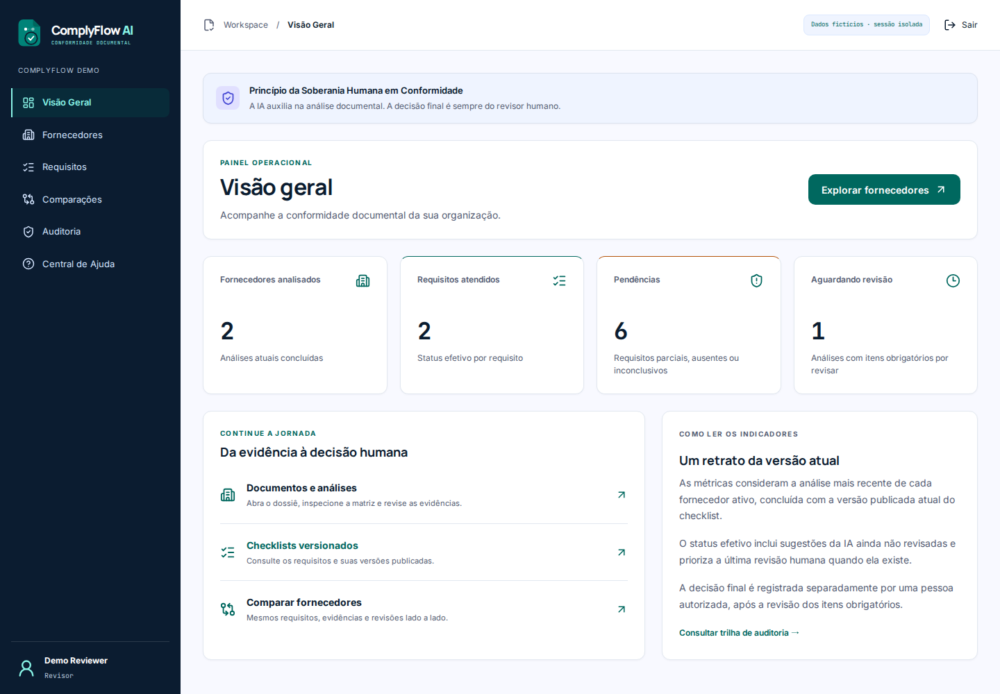
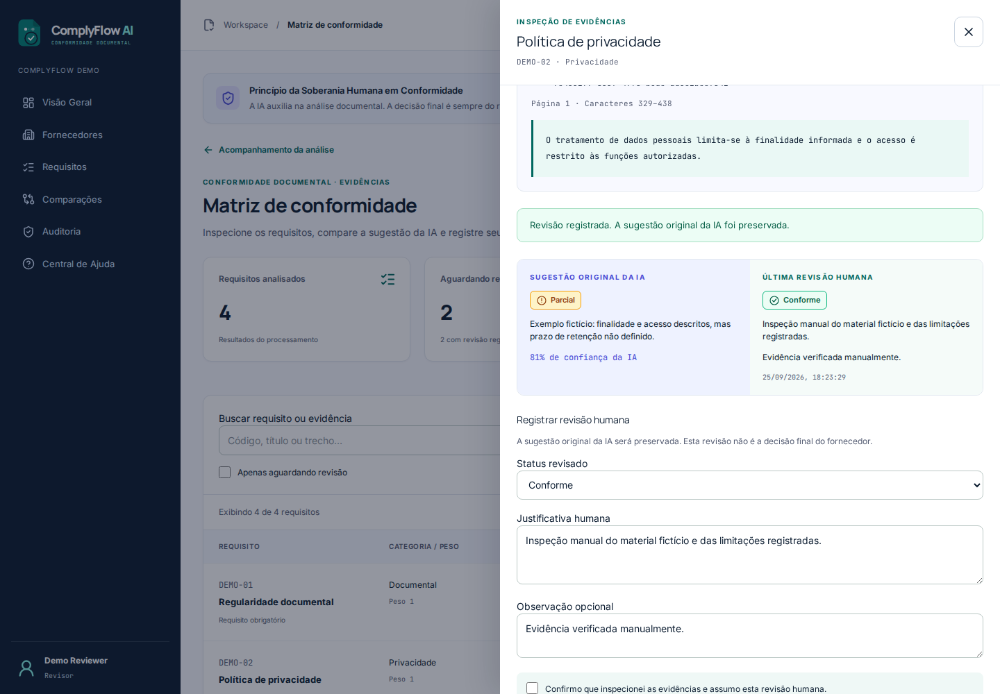
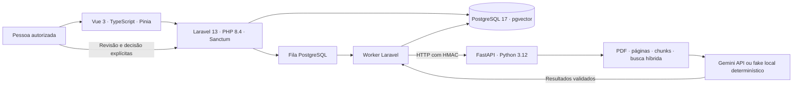

# ComplyFlow AI

Da evidência documental à decisão humana. Plataforma multi-tenant que organiza fornecedores, checklists versionados e PDFs numa matriz rastreável: sugestão assistiva, confiança, página, trecho, revisão e decisão final separadas.

Case de portfólio funcional em português, com Laravel, Vue e FastAPI. A demonstração funciona sem chave paga, usa somente dados fictícios e está publicada no Render: **[abrir ComplyFlow AI ao vivo](https://complyflow-ai.onrender.com)**. A apresentação bilíngue completa, com galeria capturada da produção, está no [README principal em inglês](../README.md) e em [português](../README.pt-BR.md).



## O que experimentar

Entre em **Explorar demonstração**, abra **NovaGuard Facilities**, siga para a matriz, inspecione as evidências e revise os quatro requisitos. A decisão final só aparece para uma pessoa autorizada após a revisão obrigatória. Em **Auditoria**, confira o registro preservado; em **Comparações**, veja dois fornecedores sob a mesma versão do checklist.

Cada visitante recebe organização e sessão próprias por 24 horas. Há três fornecedores, uma análise aguardando revisão, um histórico humano fictício e os quatro estados `met`, `partial`, `missing`, `inconclusive`. Não há senha pública: a demo cria um reviewer. [Dados e cotas da demo](docs/demo.md) · [API](docs/api.md).

A demo pode ser retomada no mesmo navegador durante essas 24 horas, inclusive após mais de duas horas sem atividade, desde que seu cookie seja preservado. Atividade não renova o prazo absoluto da demo. Contas normais usam sessão deslizante de 24 horas de inatividade por padrão; logout a invalida. [Duração e retenção das sessões](docs/security.md#duração-e-retenção-das-sessões).

Para percorrer a jornada desde o início, escolha **Criar conta** no acesso. Informe seu nome, organização, e-mail e senha de pelo menos 12 caracteres com confirmação. A conta owner começa com uma organização vazia. Em **Fornecedores**, cadastre um fornecedor; em **Requisitos**, crie e publique um checklist. Volte ao dossiê, envie um PDF fictício de `demo-assets/` e selecione a versão publicada e de 1 a 10 documentos (até 15 MiB no total). **Iniciar análise documental** abre o acompanhamento da fila real; ao concluir, a matriz oferece as evidências e a revisão humana. Uma nova execução fica disponível no dossiê após a anterior terminar, inclusive após uma decisão humana. Login, logout e recarga preservam a identidade pela sessão no servidor.

[Cadastro de conta](docs/screenshots/owner-registration.png) · [Seleção da primeira análise](docs/screenshots/owner-analysis-selection.png). Análises e revisões são acessadas pelo dossiê e pela matriz; o menu principal contém somente destinos implementados.



As capturas locais foram realizadas nas telas implementadas, com dados de QA fictícios, seguindo a referência visual Stitch “Sovereign Compliance Interface”. Valores dessas capturas podem diferir do seed atual. Fontes e ícones são servidos localmente.

[Ver também a comparação lado a lado](docs/screenshots/comparison.png).

## Arquitetura e stack



Laravel impõe tenants, permissões, idempotência, persistência e auditoria. FastAPI extrai e valida documentos em processos com limites, recupera contexto e produz sugestões estruturadas. A busca combina vetores determinísticos de 384 dimensões com correspondência textual; não promete embeddings semânticos de um modelo treinado. PDFs ficam em `bytea` no banco, sobrevivendo ao reinício do container. [Arquitetura e escolhas](docs/architecture.md).

## Executar localmente

Pré-requisitos: Git, Docker Engine/Desktop com Compose v2, OpenSSL e portas 5173/8000/8001 livres. PHP, Composer, Node e Python rodam em containers. Execute os comandos dentro desta pasta `complyflow-ai/`:

```bash
cp .env.example .env
export PROCESSOR_HMAC_SECRET="$(openssl rand -hex 32)"
docker compose up --build
```

O worker aplica migrations e seed. Aguarde os serviços; abra [localhost:5173](http://localhost:5173). O segredo exportado vale para este shell; para reutilizá-lo em outros terminais, configure seu próprio valor em `PROCESSOR_HMAC_SECRET` no `.env` local, sem versioná-lo. O Laravel gera sua APP_KEY local automaticamente. A senha `complyflow` do banco Compose é exclusivamente de desenvolvimento e o banco não publica uma porta no host.

O desenvolvimento local usa `AI_PROVIDER=fake` por padrão e não chama serviços externos. Para executar análises reais com Gemini, configure `AI_PROVIDER=gemini`, `GEMINI_API_KEY` e, opcionalmente, `GEMINI_MODEL` (padrão `gemini-3.8-flash`). O deploy Render usa Gemini com esforço de raciocínio baixo nas novas análises da conta owner; o tour sem senha usa resultados fictícios pré-carregados e não consome cota. Somente os cinco trechos recuperados por requisito são enviados ao Google, nunca o PDF completo automaticamente. `AI_DAILY_REQUIREMENT_LIMIT=20` protege a chave compartilhada com um orçamento global diário; `0` desativa esse limite no fake local.

## Testar

**Use um banco local descartável:** a suíte Laravel e `verify.sh` recriam as tabelas do Compose. O script interrompe o worker para os testes de domínio, restaura o seed, inicia a fila para o E2E e a interrompe ao terminar. Para executar testes Laravel isolados, interrompa o worker antes.

```bash
docker compose stop queue
docker compose --profile e2e build
bash scripts/verify.sh
bash scripts/production-smoke.sh
```

O primeiro script executa Laravel, Python, Vue, typecheck, lint, build e contrato HMAC entre linguagens. Depois restaura o seed, verifica a idempotência do seed e roda Playwright com a fila ativa. O navegador cobre a demo e a conta owner desde o cadastro vazio até fornecedor, checklist publicado, upload, análise real via HMAC/FastAPI fake, matriz/evidência e logout/login/recarga; não fornece respostas HTTP simuladas. O segundo constrói a imagem final e verifica health, SPA/deep links, CSRF, demo, reinício e as mesmas jornadas E2E sob 512 MiB/0,1 CPU; ao terminar remove apenas seu projeto de smoke. Requer Python 3 no host para o pequeno cliente HTTP. A [CI](../.github/workflows/ci.yml) repete essas verificações sem credenciais externas.

Para parar: `docker compose down`. Para apagar os dados locais de desenvolvimento: `docker compose down -v` (irreversível para esse volume; não use sobre uma base importante).

## Segurança e soberania humana

- UUIDs públicos, escopo obrigatório por organização, policies e RBAC no servidor; testes de IDOR entre organizações e demos.
- Cookies de sessão e CSRF na mesma origem. Em produção: cookies Secure/HttpOnly, CSP e cabeçalhos defensivos; segredos gerados por ambiente.
- Upload limitado a PDF de 5 MiB, hash/deduplicação, cotas, extração com limites de tempo/memória e conteúdo tratado como não confiável.
- Análise com orçamento total de 45 s e cancelamento cooperativo; uma execução ativa por processo, sem sobreposição de retries. [Configuração de prazos e limites](docs/processor-orchestration.md).
- Achados aceitos somente com schema, página, trecho e offsets coerentes; `missing` exige descrição da busca. A IA nunca aprova ou reprova fornecedores.
- Revisões, decisões e auditoria append-only; encadeamento de hashes detecta alterações locais, com os limites explicitados na interface.

[Modelo de segurança e riscos residuais](docs/security.md) · [Revisão humana e auditoria](docs/human-review-audit.md) · [API](docs/api.md).

## Render gratuito

O [guia de publicação](docs/render-free-deploy.md) descreve o Blueprint, geração dos segredos, banco privado, verificação e recriação. Uma imagem executa Nginx, PHP-FPM, worker e FastAPI; OCR fica desativado. O plano é uma demonstração limitada: web com 512 MB/0,1 CPU, hibernação após 15 minutos e cold start aproximado de um minuto. O Postgres gratuito tem 1 GB de armazenamento, expira em 30 dias e não oferece backups. [Limites oficiais consultados em 14/09/2026](https://render.com/docs/free).

## Limitações e próximos passos

Não há recuperação de senha, verificação de e-mail, consultas reais a órgãos públicos, certificações de segurança, assinatura digital ou homologação automática. Sugestões do Gemini podem errar e não medem conformidade jurídica. OCR não está conectado ao pipeline público; PDFs somente imagem podem resultar sem evidência. O plano gratuito não é uma oferta de produção com SLA, e a capacidade sob carga não foi certificada.

Próximos passos: armazenamento de objetos, serviços/filas separados, cache compartilhado de replay antes de escalar, outbox e reconciliação operacional de jobs interrompidos, paginação de matrizes grandes, limpeza periódica de demos, backups e observabilidade sem conteúdo sensível. Existem quatro avisos de depreciação Python sobre fork em processo multithread e um sobre TestClient/httpx; a suíte passa e esses pontos exigem evolução antes de ampliar concorrência.

Contribuições: [CONTRIBUTING.md](CONTRIBUTING.md). Código e material original: [MIT](LICENSE). Dependências mantêm suas próprias licenças; fontes locais usam OFL. [Revisão de dependências e licenças](docs/dependency-review.md).
